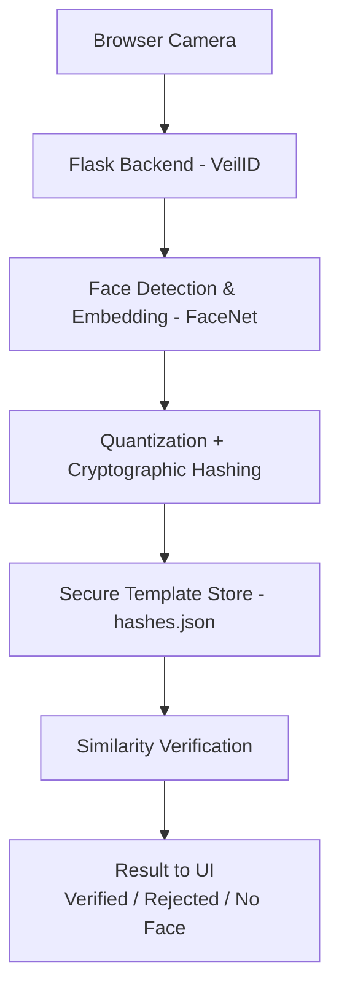

# VeilID  
### Privacy-Preserving Face Attendance & Identity Verification System  
*Federated-Learning Inspired · Biometric Template Protection · Zero Image Storage*

---

## 📌 Overview

Traditional facial recognition systems store raw face images or feature vectors in centralized databases, creating severe privacy and security risks. A database breach permanently compromises a person’s biometric identity.

**VeilID** is a privacy-first biometric verification system that:

- Never stores face images  
- Never stores raw face embeddings  
- Stores only irreversible cryptographic templates  
- Verifies identity using similarity matching on quantized, protected representations  

The system demonstrates **Privacy-by-Design** and **Biometric Template Protection** principles, inspired by **Federated Learning architectures** where sensitive data never leaves the client in raw form.

---

## 🔐 Key Features

- 📷 Live webcam capture via secure web interface  
- 🧠 FaceNet deep embedding extraction (DeepFace)  
- 🔢 Quantized biometric template generation  
- 🔑 Salted SHA-256 cryptographic hashing  
- 📊 Similarity-based verification (cosine similarity)  
- 🚫 Zero storage of face images  
- 🚫 Zero storage of full feature vectors  
- 🌐 Web-based UI (single-page, cinematic security console style)

---

## 🏗 System Architecture



## 🛡 Privacy & Security Design

| Layer | Protection |
|------|------------|
| Image | Never stored |
| Embeddings | Never stored |
| Templates | Quantized + Salted + Hashed |
| Matching | Similarity threshold (not exact hash) |
| Storage | Non-invertible biometric signatures only |

This follows principles from:

- Cancelable Biometrics  
- Fuzzy Commitment Schemes  
- Privacy-Preserving Authentication  
- Federated Learning-style local feature extraction  

---

## ⚙ Tech Stack

- **Frontend:** HTML5, CSS, JavaScript (WebRTC Camera API)  
- **Backend:** Python, Flask  
- **AI Model:** FaceNet (via DeepFace)  
- **Computer Vision:** OpenCV  
- **Cryptography:** SHA-256 with Salting  
- **Similarity Metric:** Cosine Similarity  
- **Template Protection:** Quantization + Hashing  

---

## 🚀 How to Run

### 1. Create Virtual Environment & Install Dependencies

```bash
python -m venv venv
venv\Scripts\activate
pip install -r requirements.txt

```

---

2. Start Server
python server/app.py
http://127.0.0.1:5000


---

## 📁 Project Screenshot


